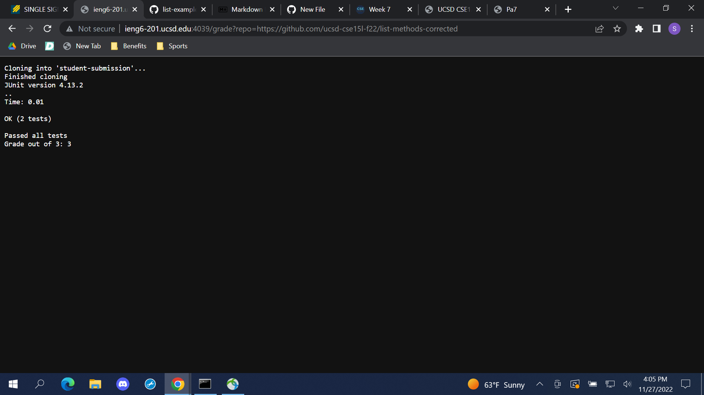
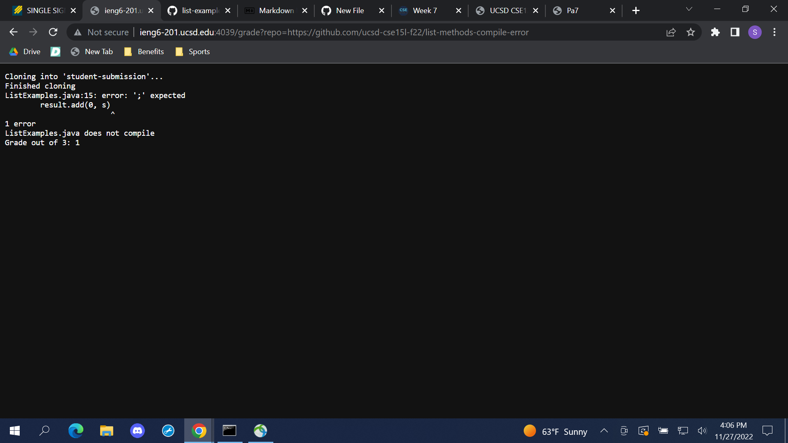
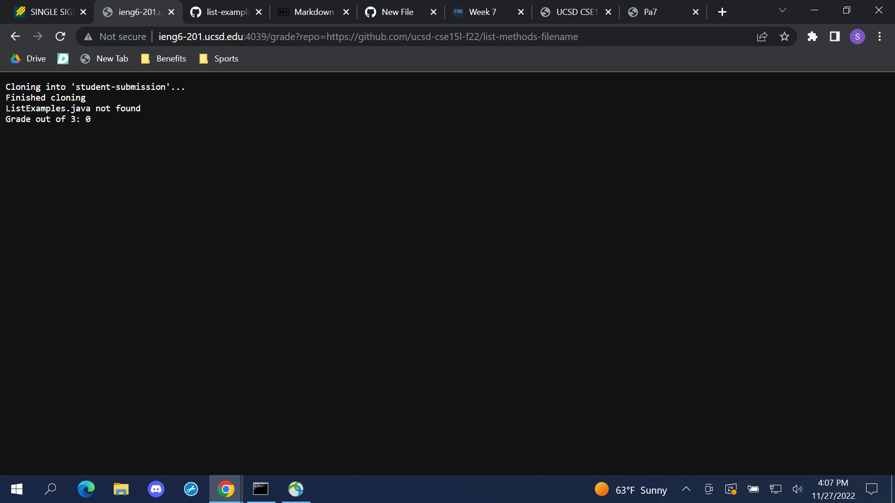

# Lab Report 5 - Week 9
## Sarah Tareen

**Grade.sh**
```
rm -rf student-submission
git clone $1 student-submission
echo "Finished cloning"

cd student-submission
GRADE=0
if [[ ! -f ListExamples.java ]]
then 
    echo "ListExamples.java not found"
    echo "Grade out of 3: "$GRADE
    exit 1
fi
GRADE=1

cd ..
cp TestListExamples.java student-submission/
cp -r lib student-submission/
cd student-submission/

javac -cp .:../lib/hamcrest-core-1.3.jar:../lib/junit-4.13.2.jar *.java
if [[ $? -ne 0 ]]
then
  echo "ListExamples.java does not compile"
  echo "Grade out of 3: "$GRADE
  exit 1
fi
GRADE2

java -cp .:../lib/hamcrest-core-1.3.jar:../lib/junit-4.13.2.jar org.junit.runner.JUnitCore TestListExamples

if [[ $? -ne 0 ]]
then
  echo "Failed tests"
  echo "Grade out of 3: "$GRADE
else
  echo "Passed all tests"
  echo "Grade out of 3: 3"
fi
```

**Graded Student Repositories**





**Trace Script for Student Repository**
*https://github.com/ucsd-cse15l-f22/list-methods-compile-error*

*Standard Output/Error and Return Codes for Each Command Line*
Line 1   Return Code: 0                                                                                             
Line 2   Return Code: 0                                                                                             
Line 3   Return Code: 0                                                                                             
Line 4   Return Code: 0                                                                                            
Line 13  Return Code: 0                                                                                            
Line 14  Return Code: 0                                                                                            
Line 15  Return Code: 0                                                                                            
Line 16  Return Code: 0                                                                                             
Line 17  Return Code: 1
         Standard Error:
         
         ```
         ListExamples.java:15: error: ';' expected              
                   result.add(0, s)
                                   ^                    
         1 error
         ```

Line 20   Standard Output:

          ``
          ListExamples.java does not compile 
          ```
          
Line 21   Standard Output:

          ```
          Grade out of 3: 1
          ```

The rest of the lines did not have a standard/error output or a return code. 

*if statements*

Line 6: The first if statement was true because the ListExamples.java file  was found in the right place in the students repository and successfully added to the student-submission directory. 

Line 18: The second if statement was true because the ListExamples.java file was unable to compile and the return code was not 0 for the javac command.

Line 26: The third if statement was not run because the bash script was exited after the file couldn't compile. 

*Lines not run*

Lines 23-33 were not run because the code exited early in the second if statement. 


