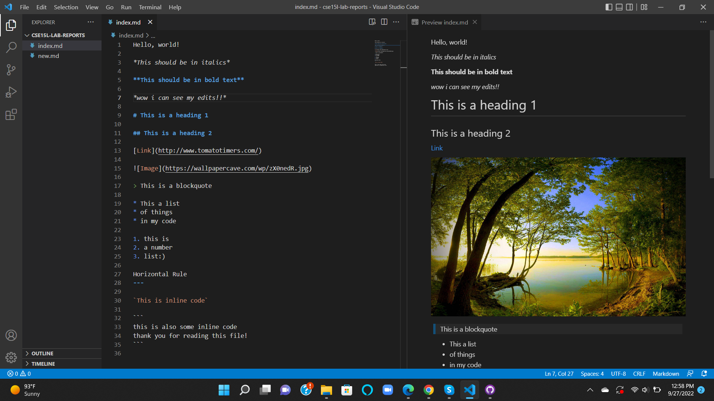
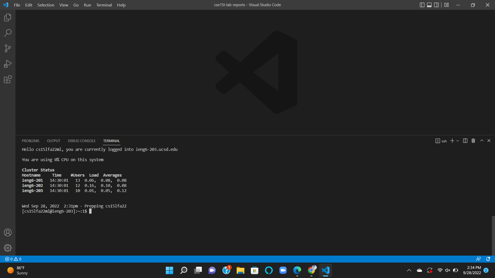
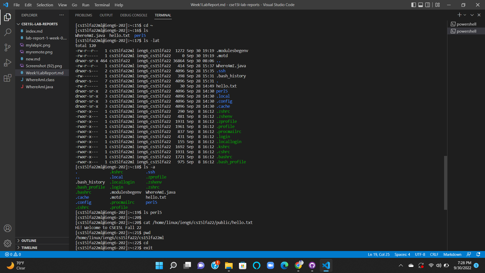
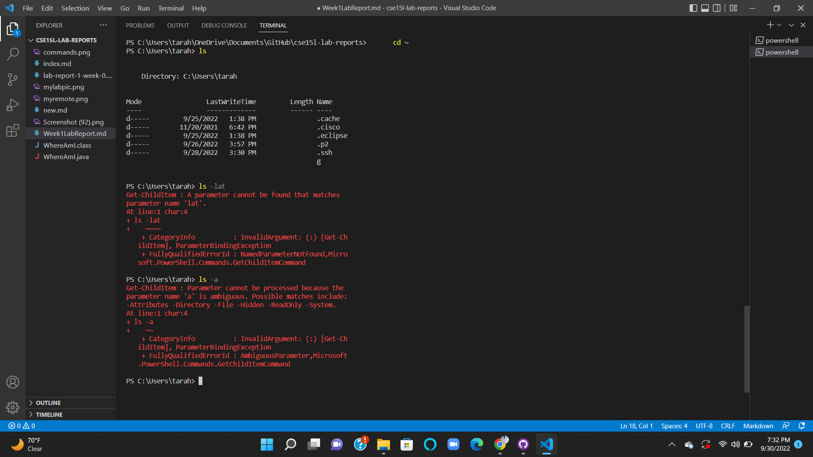
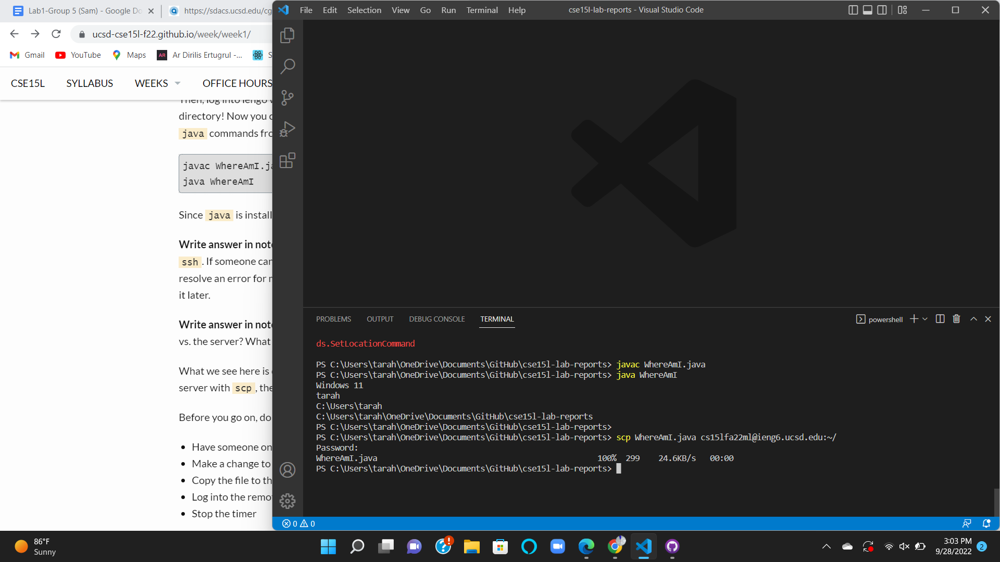
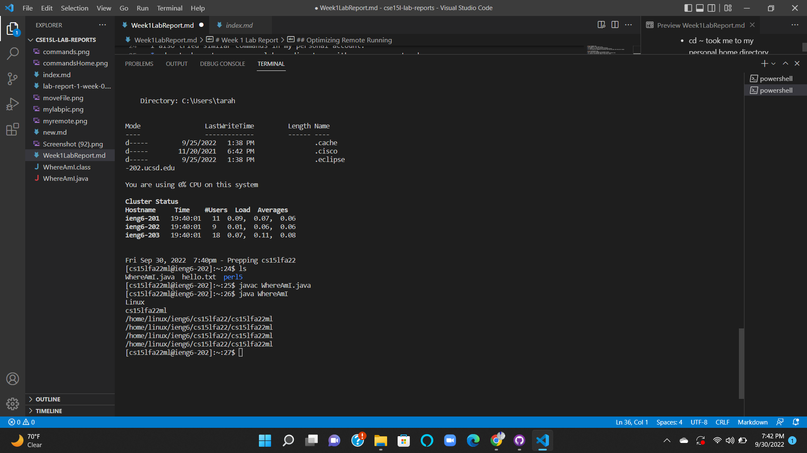
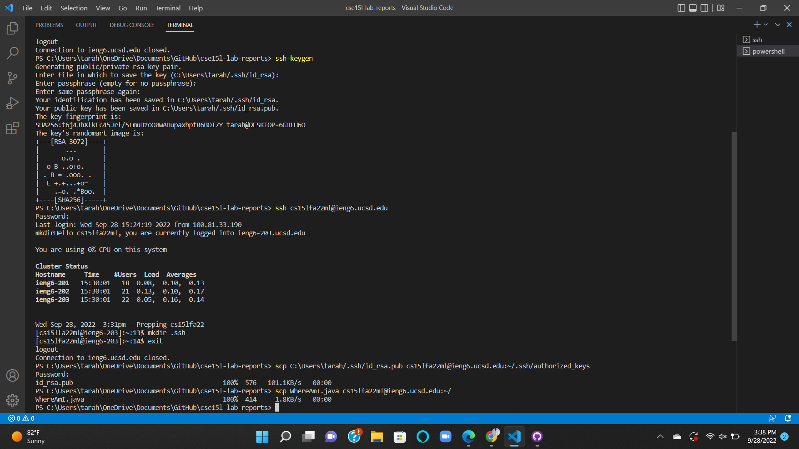
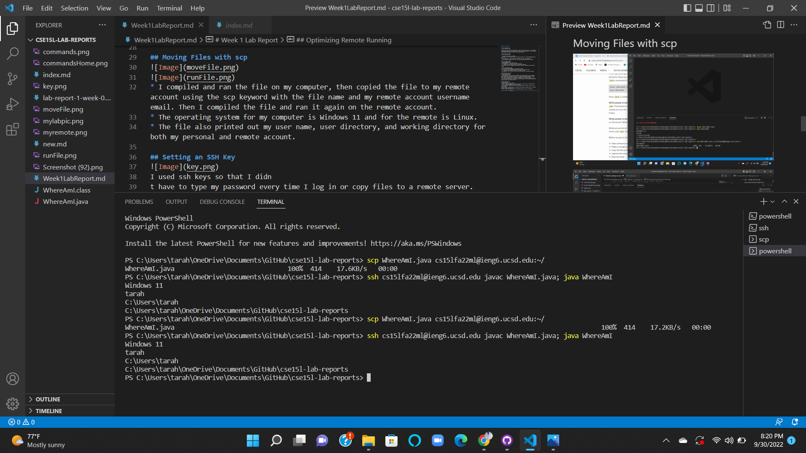

# Week 1 Lab Report

## Installing VScode

In order to install Visual Studio Code, I went to the link [VSCode install](https://code.visualstudio.com/) and followed the instructions to download it on my computer. I downloaded the Windows version for my personal laptop.

## Remotely Connecting

* I opened the terminal in VSCode.
* I typed in "ssh" followed by my username email which is "cs15lfa22ml@ieng6.ucsd.edu".
* I responded yes to the authenticity message the first time logging in.
* Then I typed my password in for my  CS 15L account(password does not show).

## Trying Some Commands

I tried commands in the remote server. 
* For example, cd ~ took me to the home directory
* ls listed out files and directories in the home directory
* ls -lat printed out categories of different files and the dates that they were created

I also tried similar commands in my personal account.
* cd ~ took me to my personal home directory with my username tarah.
* ls listed all the different types of files that I have.
* The modifiers for ls such as -lat and -a didn't work for my personal account.

## Moving Files with scp

* I compiled and ran the file on my computer, then copied the file to my remote account using the scp keyword with the file name and my remote account username email. Then I compiled the file and ran it again on the remote account.
* The operating system for my computer is Windows 11 and for the remote is Linux.
* The file also printed out my user name, user directory, and working directory for both my personal and remote account.

## Setting an SSH Key

I used ssh keys so that I didn
t have to type my password every time I log in or copy files to a remote server.
* First I typed ssh-keygen to open the program.
* I clicked enter when asked for a file to save the key in order to save it to a default path.
* This created a private file in my personal account and a public key in my remote account in the .ssh directory.
* Then I copied the public key to my personal account in the .ssh directory 

## Optimizing Remote Running

In order to make the process of copying a file to the remote server faster I used the up key on the keyboard to quickly get the commands for copying the file and logging in to the remote server. I also logged in, compiled, and ran the file all in one step. This way I was able to copy and run the file in just 6 keystrokes.
