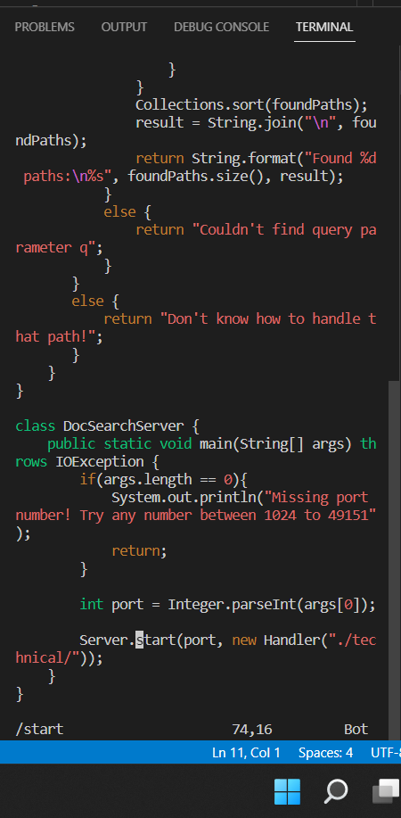
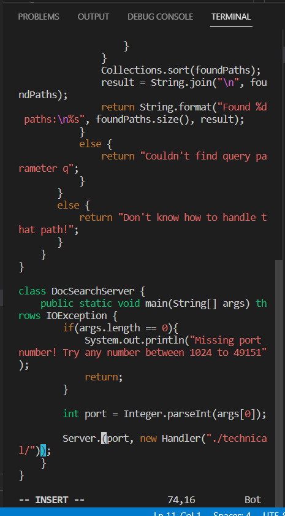
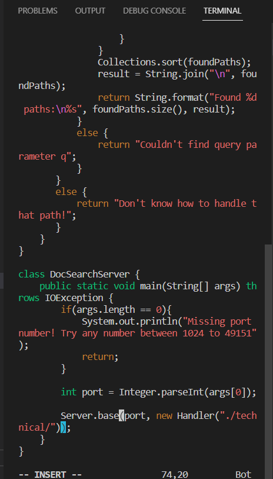
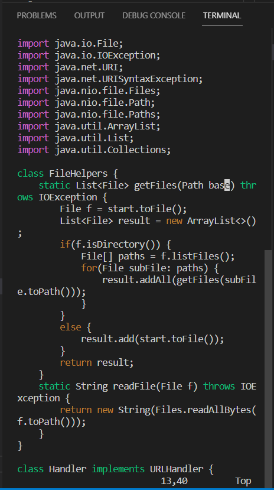
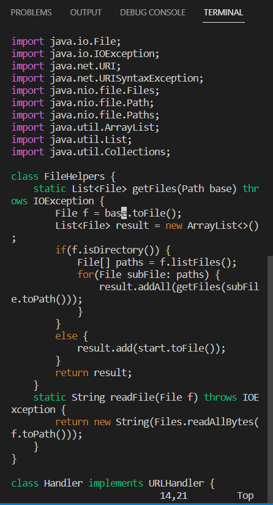
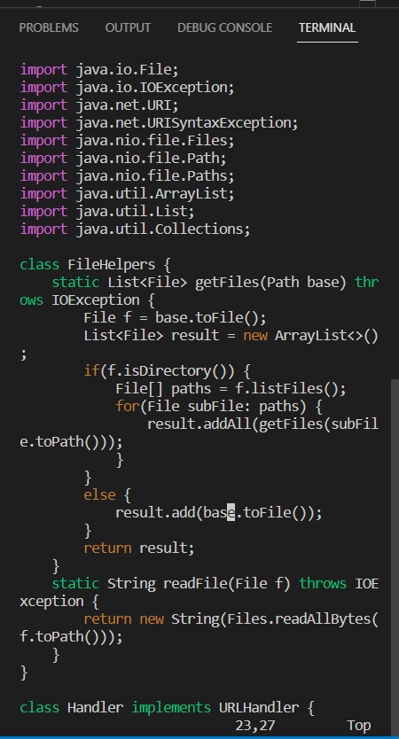

# Lab Report 4 (Week 7)
*Week 6 Lab Material*

## Part 1
**Task: In DocSearchServer.java, change the name of the start parameter of getFiles, and all of its uses, to instead be called base.

```
/start<Enter>
```


First we search for start in the file.


```
ce
```


Then we delete the word start in insert mode.

```
base<Escape>
```


We replace start with the word base and escape to go back into normal mode.

```
n.n.n.
```




We type n to go to the next occurence of start and click . to repeat the previous commands. We do this 3 times because there are 3 more starts in the file.

## Part 2
It took me 75 seconds to run the first style. It was a little more difficult to find all the starts quickly since there isn't a search function that I know of. It also takes more time to get all the different commands like scp and ssh together.

It took me 52 seconds to run the second style. It was easy to run because I knew all the commmands for vim before so it was more automatic. It may have taken more time if I didn't know which commands to use in vim.

I would prefer using the second style remotely because it is easier to do since everything is done remotely, even though it does take some time to get used to vim. You don't need to know all the fancy commands to use vim anyway. It's also easier to test since you don't have to copy your code to remote every time you make a change. 
Maybe if we want the file to work on local computer or if there are more programs that need to be used for the code in the local computer then it is better to use the first option in order to be able to go back and forth between local and remote. Otherwise, it seems more efficient to do this the second way.
