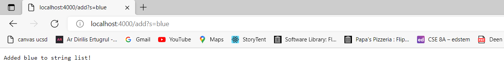
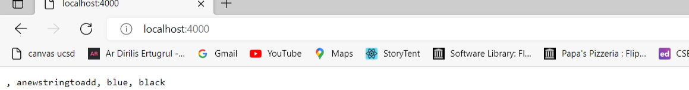
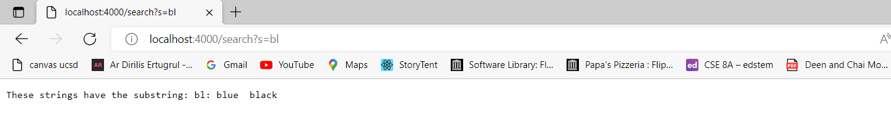

# Lab Report 2 Week 3
## Sarah Tareen
---

## Part 1
**Simplest Search Engine**
```
import java.io.IOException;
import java.net.URI;
import java.util.ArrayList;
import java.util.List;

class Handler implements URLHandler {
  ArrayList<String> stringList = new ArrayList<>();

    public String handleRequest(URI url) {
        if (url.getPath().equals("/")) {
            String currentString = "";
            for (int i = 0; i < stringList.size(); i++) {
              currentString = currentString + " " + stringList.get(i);
            }
            return currentString;
        } else {
            System.out.println("Path: " + url.getPath());
            if (url.getPath().contains("/add")) {
                String[] parameters = url.getQuery().split("=");
                if (parameters[0].equals("s")) {
                    stringList.add(parameters[1]);
                    return "Added " + parameters[1] + " to string list!";
                }
            }
             if (url.getPath().contains("/search")) {
                String[] parameters = url.getQuery().split("=");
                if (parameters[0].equals("s")) {
                    String matchedStrings = "";
                    for (int i = 0; i < stringList.size(); i++) {
                      if (stringList.get(i).contains(parameters[1])) {
                        matchedStrings = matchedStrings + " " + stringList.get(i) + " ";
                      }
                    }
                    return "These strings have the substring: " + parameters[1] + ":" + matchedStrings;
                }
            }
            return "404 Not Found!";
        }
    }
}

class SearchEngine {
    public static void main(String[] args) throws IOException {
        if(args.length == 0){
            System.out.println("Missing port number! Try any number between 1024 to 49151");
            return;
        }

        int port = Integer.parseInt(args[0]);

        Server.start(port, new Handler());
    }
}

```


*Methods called:* First the main method was called and then handleRequest.

*Arguments and Fields:* When I called the main method, this passed in the argument of the port that was used in order to run the server. The argument 4000 was passed in and opened the port and created a new Handler. This caused the handleRequest method to be called using the url of the new web server created. This method checked the path of the web server which contained "/add" and then used query and the "=" delimeter to determine which String to add to the ArrayList field stringList. The string "blue" was added to it. 


*Methods called:* handleRequest

*Arguments and Fields:* The handleRequest method handled a different url this time with the root path "/" causing the website to print out every string in the ArrayList. I had already added the strings "anewStringtoadd", "blue", and "black" to the ArrayList stringList before using the "/add" path. 


*Methods called:* handleRequest

*Arguments and Fields:* The handleRequest method handled a different url with a different path "/search" and a query. The method parsed the query using the "=" delimeter to find which substring to search for in the ArrayList stringList, which in this example was "bl". The method then searched through each string that contains the substring in stringList and prints them out in a statement to the web server. 

## Part 2

**Debugging**
The failure-inducing input (the code of the test)
The symptom (the failing test output)
The bug (the code fix needed)
Then, explain the connection between the symptom and the bug. Why does the bug cause that particular symptom for that particular input?
*Testing the method reversed in ArrayExamples.java*
1. Failure-inducing input: I passed in the array {1, 2, 3} into the method reversed
```
 @Test
  public void testReversedOddElements() {
    int[] input1 = {1, 2, 3};
    assertArrayEquals(new int[]{3, 2, 1}, ArrayExamples.reversed(input1));
  }
```
2. Symptom: The JUnit test threw a java.lang.Assertion Error because the first and the last element in the array didn’t match the expected output.
```
Caused by: java.lang.AssertionError: expected:<3> but was:<0>
```

3. Bug: The method makes a new array but then copies the indexes of the new array, which are all 0 because they have not been initialized, into the indexes of the original array and then returns it. 
```
for(int i = 0; i < arr.length; i += 1) {
      arr[i] = newArray[arr.length - i - 1];
    }
    return arr;
```
4. Connection: The bug causes the test to output a java.lang.AssertionError because the indexes of the new array that hasn't been initialized yet is being copied into the original array, which is then returned. The expected output is that the indexes in the passed in array should be reversed in the order {3, 2, 1}, but the actual output is {0, 0, 0}. These arrays do not match causing assertArrayEquals to throw an error. 

*Testing the method filter in ListExamples.java*
1. Failure-inducing input: Failure input: I passed in the Arraylist<String> into the method reversed
```
  @Test
    public void testFilter() {
        List<String> input1 = new ArrayList<>();
        input1.add("Sarah");
        input1.add("b");
        input1.add("Kate");
        input1.add("d");
        List<String> expected = new ArrayList<>();
        expected.add("Sarah");
        expected.add("Kate");
        assertEquals(expected, ListExamples.filter(input1, new ContainsA()));
    }
```

2. Symptom: The JUnit test threw a java.lang.Assertion Error because the first and the last element in the array was in the reverse order compared to the expected output.
```
java.lang.AssertionError: expected:<[Sarah, Kate]> but was:<[Kate, Sarah]>
```

3. Bug: The method adds the strings that have condition to the zero index but the expected output is that the strings should appear in the same order they were in the original list. So this bug causes the strings to be in the reverse order.
``` 
if(sc.checkString(s)) {
        result.add(0, s);
}
```
4. Connection: The bug caused the output to be a java.lang.AssertionError because the method filter added the strings that matched the condition in the StringChecker method to the zero index in the returned string. However, the expected output was that the strings should be in the same order as they were originally, which should be [Kate, Sarah] in this case. The method finds the correct strings but returns them in reverse order because the strings are added to the beginning of the list, when they should have been added to the end of the returned list. Since the expected list didn't match the actual list returned, this caused the assertEquals method to throw an error. 


